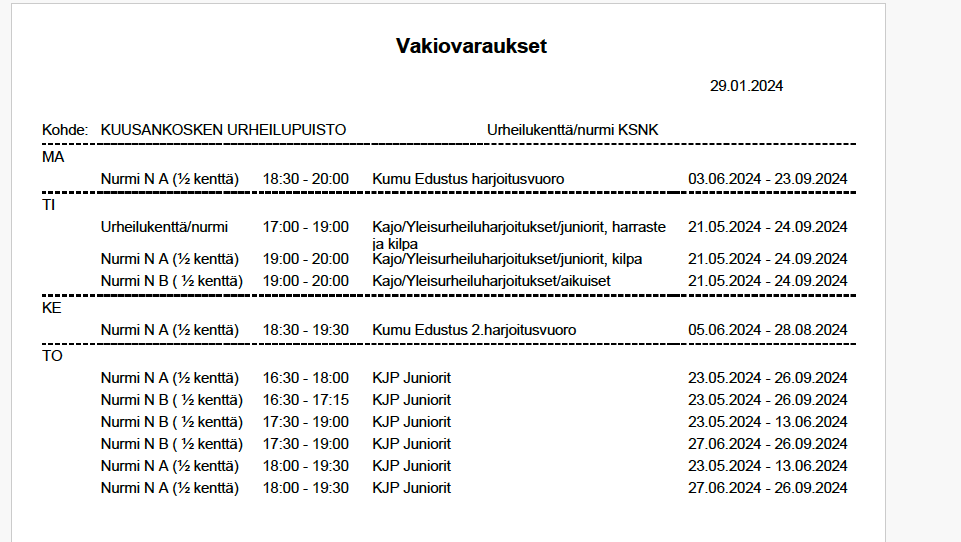
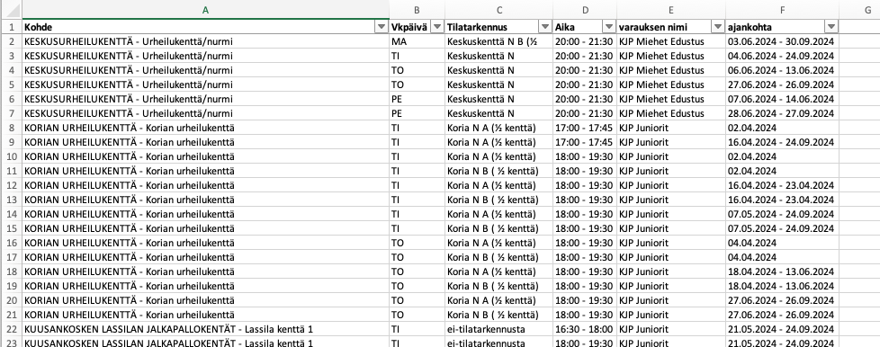

# Kouvola liikuntapaikka - Vakiovuorot to Spreadsheet

So you got your club's sport venue reservations from City of Kouvola as unstructured PDF file and you want to search your club's resources only and work in spreadsheet format instead?

So you got 150 pages like this...

... that you want to turn in to this:

Then follow these steps:

1. Open the PDF file, select all text (ctrl + a in Windows, cmd + a in Mac)
2. Copy the text to clipboard
3. Paste the text as PLAIN TEXT to a file and save it as `vakiovuorot_dump.txt`.
    - You can use Notedad or TextEdit to create the file to ensure it is plain text.
4. Copy the Python `parser.py` script to your machine, edit the `searchString` (defaults to `"KJP") to match your wanted search. For example "Kajo" or "Purha".
5. Ppen your terminal and run the script
6. Copy the output to your favorite spreadsheet tool, i.e. Microsoft Excel
7. Move text to colums (separate by comma) and filter as you like.
8. Happy planning!

As the City of Kouvola might change the layout, do some checks between the output and original PDF to make sure it still works.
